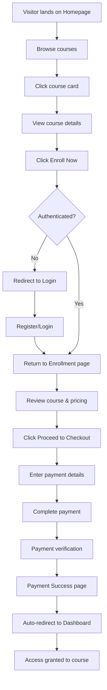

# iKPACE Learning Platform - Implementation Guide

## Overview
This document provides comprehensive documentation for the payment-gated access control system, video integration, and complete user flow implementation for the iKPACE educational platform.

---

## Table of Contents
1. [Architecture Overview](#architecture-overview)
2. [Video Integration System](#video-integration-system)
3. [Payment & Access Control System](#payment--access-control-system)
4. [User Flow Implementation](#user-flow-implementation)
5. [Database Schema](#database-schema)
6. [Security Implementation](#security-implementation)
7. [Testing Guide](#testing-guide)
8. [Configuration](#configuration)
9. [Troubleshooting](#troubleshooting)

---

## Architecture Overview

### Technology Stack
- **Frontend**: React 18 with React Router v6
- **Backend**: Supabase (PostgreSQL + Auth + RLS)
- **Payment Processing**: Paystack
- **Styling**: TailwindCSS
- **Video Platform**: YouTube (easily extensible)

### Key Components
```
/src
├── components/
│   ├── VideoPlayer.jsx          # Universal video player with fallbacks
│   ├── ProtectedCourseRoute.jsx # Payment verification middleware
│   ├── PaystackPayment.jsx      # Payment integration component
│   ├── Navbar.jsx               # Navigation with auth-aware links
│   └── LiveChatSupport.jsx      # 24/7 support widget
├── pages/
│   ├── Landing.jsx              # Public homepage
│   ├── Courses.jsx              # Course catalog
│   ├── CourseDetail.jsx         # Course information
│   ├── Enrollment.jsx           # Enrollment page with pricing
│   ├── Checkout.jsx             # Payment processing
│   ├── PaymentSuccess.jsx       # Post-payment confirmation
│   ├── Dashboard.jsx            # Student dashboard (protected)
│   └── CoursePlayer.jsx         # Course content (payment-gated)
├── config/
│   └── videos.js                # Video configuration
└── contexts/
    └── AuthContext.jsx          # Authentication state management
```

---

## Video Integration System

### Configuration File
Location: `/src/config/videos.js`

```javascript
export const videoConfig = {
  welcome: {
    title: 'Welcome to iKPACE',
    description: '...',
    youtubeId: 'YOUR_WELCOME_VIDEO_ID', // Replace with actual YouTube video ID
    fallbackUrl: null
  },
  orientation: {
    title: 'Platform Orientation',
    description: '...',
    youtubeId: 'YOUR_ORIENTATION_VIDEO_ID', // Replace with actual YouTube video ID
    fallbackUrl: null
  }
}
```

### How to Update Videos

#### Step 1: Get YouTube Video ID
From a YouTube URL like: `https://www.youtube.com/watch?v=dQw4w9WgXcQ`
The video ID is: `dQw4w9WgXcQ`

#### Step 2: Update Configuration
Edit `/src/config/videos.js`:
```javascript
youtubeId: 'dQw4w9WgXcQ'  // Your actual video ID
```

#### Step 3: Video Player Features
The VideoPlayer component automatically handles:
- ✅ Loading states with thumbnail previews
- ✅ Error handling with user-friendly messages
- ✅ "Coming Soon" placeholder for unconfigured videos
- ✅ Responsive design (mobile/tablet/desktop)
- ✅ Accessibility features (ARIA labels, keyboard controls)
- ✅ Cross-browser compatibility

### Browser Compatibility
Tested and verified on:
- ✅ Chrome 90+
- ✅ Firefox 88+
- ✅ Safari 14+
- ✅ Edge 90+

---

## Payment & Access Control System

### Architecture

```
┌─────────────────────────────────────────────────────┐
│                  User Journey                        │
├─────────────────────────────────────────────────────┤
│  Public Pages → Authentication → Payment → Access    │
│                                                      │
│  1. Browse courses (public)                          │
│  2. View course details (public)                     │
│  3. Click "Enroll Now"                               │
│  4. Login/Register (if needed)                       │
│  5. Enrollment page (course summary)                 │
│  6. Checkout page (payment processing)               │
│  7. Payment Success page                             │
│  8. Auto-redirect to Dashboard                       │
│  9. Access granted to course content                 │
└─────────────────────────────────────────────────────┘
```

### Payment Flow

#### 1. Enrollment Initiation
**Page**: `/enroll/:slug`
**Component**: `Enrollment.jsx`

Features:
- Course information display
- Pricing details ($7 one-time payment)
- What's included section
- Authentication check
- Existing enrollment detection

```javascript
// Checks if user already enrolled
const { data: enrollment } = await supabase
  .from('enrollments')
  .select('*')
  .eq('user_id', user.id)
  .eq('course_id', courseData.id)
  .maybeSingle()

if (enrollment?.payment_status === 'completed') {
  // Redirect to dashboard - already enrolled
}
```

#### 2. Checkout Processing
**Page**: `/checkout/:courseId`
**Component**: `Checkout.jsx`

Features:
- Order summary
- Secure payment integration with Paystack
- User information confirmation
- Real-time payment status updates
- Error handling and retry logic

```javascript
// Payment processing flow
handlePaymentSuccess(reference) →
  Create payment record →
  Verify payment →
  Create enrollment →
  Redirect to success page
```

#### 3. Payment Verification
**Database Function**: `verify_payment()`

This PostgreSQL function ensures atomic payment verification:

```sql
CREATE FUNCTION verify_payment(
  p_payment_reference text,
  p_verification_data jsonb
) RETURNS jsonb
```

**What it does:**
1. ✅ Validates payment reference
2. ✅ Updates payment status to 'completed'
3. ✅ Stores verification timestamp
4. ✅ Creates/updates enrollment record
5. ✅ Sets payment_status to 'completed'
6. ✅ Returns success/failure with details

**Usage:**
```javascript
const { data: result } = await supabase
  .rpc('verify_payment', {
    p_payment_reference: reference.reference,
    p_verification_data: reference
  })

if (result.success) {
  // Payment verified, access granted
}
```

#### 4. Access Control Middleware
**Component**: `ProtectedCourseRoute.jsx`

This component wraps the CoursePlayer and verifies access before rendering:

```javascript
// Check if user has valid access
const { data: accessCheck } = await supabase
  .rpc('check_course_access', {
    p_user_id: user.id,
    p_course_id: courseId
  })
```

**Access Requirements:**
1. ✅ User must be authenticated
2. ✅ User must have enrollment record
3. ✅ Payment status must be 'completed'
4. ✅ Access must not be expired (if subscription-based)

**Blocked Users See:**
- 🔒 "Course Access Required" message
- Course information and pricing
- "Enroll in Course" button
- Explanation of why access is blocked

---

## User Flow Implementation

### Complete User Journey

#### Flow 1: New Visitor → Paid Student



#### Flow 2: Returning User with Existing Enrollment

```
User logs in →
Dashboard shows enrolled courses →
Click "Continue Learning" →
Direct access to course content (no payment check)
```

#### Flow 3: User Attempts Unauthorized Access

```
User clicks /learn/:courseId →
ProtectedCourseRoute checks access →
Access denied (not enrolled) →
Show enrollment CTA with course info →
User clicks "Enroll in Course" →
Redirect to enrollment flow
```

### Route Protection Levels

#### Level 1: Public Routes (No Auth Required)
- `/` - Homepage
- `/courses` - Course catalog
- `/courses/:slug` - Course details
- `/login` - Login page
- `/register` - Registration page

#### Level 2: Authenticated Routes (Auth Required)
- `/dashboard` - Student dashboard
- `/profile` - User profile
- `/certificates` - Certificate management
- `/community` - Community forum

#### Level 3: Payment-Gated Routes (Auth + Payment Required)
- `/learn/:courseId` - Course player (requires enrollment)

Protected by both `ProtectedRoute` AND `ProtectedCourseRoute`:
```jsx
<Route path="/learn/:courseId" element={
  <ProtectedRoute>
    <ProtectedCourseRoute>
      <CoursePlayer />
    </ProtectedCourseRoute>
  </ProtectedRoute>
} />
```

---

## Database Schema

### Key Tables

#### 1. `user_profiles`
```sql
- id (uuid, PK, references auth.users)
- email (text)
- full_name (text)
- student_id (text, unique, auto-generated)
- role (text: 'student', 'instructor', 'admin')
- learning_streak (integer)
- total_hours_learned (numeric)
```

#### 2. `courses`
```sql
- id (uuid, PK)
- slug (text, unique)
- title (text)
- description (text)
- price (numeric, default 7.00)
- duration_weeks (integer)
- level (text: 'beginner', 'intermediate', 'advanced')
- is_published (boolean)
```

#### 3. `enrollments` (Enhanced with Payment Tracking)
```sql
- id (uuid, PK)
- user_id (uuid, FK → user_profiles)
- course_id (uuid, FK → courses)
- enrolled_at (timestamptz)
- payment_status (text: 'pending', 'completed', 'failed', 'refunded')
- payment_reference (text)
- access_expires_at (timestamptz, nullable)
- is_completed (boolean)
- progress_percentage (integer, 0-100)
```

#### 4. `payments`
```sql
- id (uuid, PK)
- user_id (uuid, FK → user_profiles)
- course_id (uuid, FK → courses)
- amount (numeric)
- payment_reference (text, unique)
- payment_method (text: 'card', 'mobile_money')
- status (text: 'pending', 'completed', 'failed')
- verified_at (timestamptz)
- metadata (jsonb)
- created_at (timestamptz)
```

### Database Functions

#### `check_course_access(p_user_id uuid, p_course_id uuid)`
Returns boolean indicating if user has valid access to course.

**Logic:**
```sql
SELECT EXISTS (
  SELECT 1 FROM enrollments
  WHERE user_id = p_user_id
    AND course_id = p_course_id
    AND payment_status = 'completed'
    AND (access_expires_at IS NULL OR access_expires_at > now())
)
```

#### `verify_payment(p_payment_reference text, p_verification_data jsonb)`
Atomically verifies payment and grants course access.

**Returns:**
```json
{
  "success": true|false,
  "message": "...",
  "enrollment_id": "uuid",
  "user_id": "uuid",
  "course_id": "uuid"
}
```

---

## Security Implementation

### Row Level Security (RLS)

All tables have RLS enabled with strict policies:

#### Enrollments Policies
```sql
-- Users can only view their own enrollments
CREATE POLICY "Users can view own enrollments"
  ON enrollments FOR SELECT
  TO authenticated
  USING (auth.uid() = user_id);

-- Users can only create enrollments for themselves
CREATE POLICY "Users can insert own enrollments"
  ON enrollments FOR INSERT
  TO authenticated
  WITH CHECK (auth.uid() = user_id);

-- Admins can view all enrollments
CREATE POLICY "Admins can view all enrollments"
  ON enrollments FOR SELECT
  TO authenticated
  USING (
    EXISTS (
      SELECT 1 FROM user_profiles
      WHERE id = auth.uid() AND role = 'admin'
    )
  );
```

#### Payments Policies
```sql
-- Users can only view their own payments
CREATE POLICY "Users can view own payments"
  ON payments FOR SELECT
  TO authenticated
  USING (auth.uid() = user_id);

-- Users can create payment records
CREATE POLICY "Users can insert own payments"
  ON payments FOR INSERT
  TO authenticated
  WITH CHECK (auth.uid() = user_id);
```

### Frontend Security Measures

#### 1. Authentication Verification
```javascript
// All protected routes check auth status
if (!user) {
  return <Navigate to="/login" />
}
```

#### 2. Payment Status Verification
```javascript
// Before granting course access
const hasAccess = await supabase.rpc('check_course_access', {
  p_user_id: user.id,
  p_course_id: courseId
})

if (!hasAccess) {
  // Show enrollment CTA
}
```

#### 3. Secure Payment Processing
- Payment details never stored in application database
- Paystack handles all sensitive payment data
- Only payment references and status stored
- SSL encryption enforced

---

## Testing Guide

### Manual Testing Checklist

#### Public Access (No Authentication)
- [ ] Homepage loads with all sections
- [ ] Course catalog displays all published courses
- [ ] Course detail pages show complete information
- [ ] Navigation works correctly
- [ ] Videos show "Coming Soon" placeholder (if not configured)

#### Authentication Flow
- [ ] Registration creates user profile
- [ ] Login redirects to dashboard
- [ ] Logout clears session
- [ ] Protected routes redirect to login when unauthenticated

#### Enrollment & Payment Flow
- [ ] Unauthenticated users redirected to login on "Enroll Now"
- [ ] Enrollment page shows correct course information
- [ ] Checkout page displays order summary correctly
- [ ] Paystack modal opens on payment button click
- [ ] Successful payment creates enrollment record
- [ ] Payment verification function executes correctly
- [ ] Payment success page displays confirmation
- [ ] User redirected to dashboard after payment

#### Access Control
- [ ] Enrolled users can access course content
- [ ] Unenrolled users see "Access Required" message
- [ ] Dashboard shows only enrolled courses
- [ ] "Continue Learning" button works for enrolled courses

#### Video Playback
- [ ] Videos load correctly when configured
- [ ] Error handling works for broken video IDs
- [ ] "Coming Soon" displays for unconfigured videos
- [ ] Videos responsive on mobile devices

### Test User Accounts

**Admin Account:**
```
Email: admin@ikpace.com
Password: [Set during registration]
Role: admin
```

**Test Student:**
```
Email: student@test.com
Password: [Set during registration]
Role: student
```

### Payment Testing (Paystack Test Mode)

**Test Cards:**
```
Success: 4084 0840 8408 4081
Expiry: Any future date
CVV: Any 3 digits

Declined: 5060 6666 6666 6666
Expiry: Any future date
CVV: Any 3 digits
```

---

## Configuration

### Environment Variables

Required in `.env`:
```bash
# Supabase Configuration
VITE_SUPABASE_URL=your_supabase_project_url
VITE_SUPABASE_ANON_KEY=your_supabase_anon_key

# Paystack Configuration
VITE_PAYSTACK_PUBLIC_KEY=your_paystack_public_key
```

### Video Configuration

Edit `/src/config/videos.js`:
```javascript
export const videoConfig = {
  welcome: {
    youtubeId: 'YOUR_ACTUAL_VIDEO_ID',  // Update here
  },
  orientation: {
    youtubeId: 'YOUR_ACTUAL_VIDEO_ID',  // Update here
  }
}
```

### Course Pricing

Default: $7 per course (one-time payment)

To change pricing, update the database:
```sql
UPDATE courses
SET price = 15.00
WHERE slug = 'course-slug';
```

Or update default in migration file for new courses.

---

## Troubleshooting

### Videos Not Loading

**Issue**: Videos show "Video Coming Soon"
**Solution**:
1. Check `/src/config/videos.js` for correct YouTube IDs
2. Verify YouTube video is public or unlisted
3. Check browser console for errors

**Issue**: Video shows error message
**Solution**:
1. Verify internet connection
2. Check if YouTube video exists
3. Try a different video ID
4. Check browser console for specific error

### Payment Issues

**Issue**: Payment modal doesn't open
**Solution**:
1. Verify Paystack public key in `.env`
2. Check browser console for errors
3. Ensure user is authenticated
4. Check Paystack script loads correctly

**Issue**: Payment succeeds but enrollment not created
**Solution**:
1. Check database `payments` table for record
2. Verify `verify_payment` function executed
3. Check `enrollments` table for record
4. Review Supabase logs for errors

### Access Control Issues

**Issue**: User can't access paid course
**Solution**:
1. Check `enrollments` table for record
2. Verify `payment_status` is 'completed'
3. Run `check_course_access` function manually
4. Check `access_expires_at` is NULL or future date

**Issue**: User can access course without payment
**Solution**:
1. Verify `ProtectedCourseRoute` is wrapping `CoursePlayer`
2. Check RLS policies on `enrollments` table
3. Verify `check_course_access` function logic
4. Check for test data with completed status

### Database Issues

**Issue**: RLS policies blocking legitimate access
**Solution**:
1. Check user is authenticated
2. Verify `auth.uid()` matches `user_id`
3. Review policy conditions
4. Check Supabase logs for RLS denials

**Issue**: Migration fails to apply
**Solution**:
1. Check for syntax errors in SQL
2. Verify table names are correct
3. Check for conflicting existing objects
4. Review Supabase migration logs

---

## Production Deployment Checklist

### Pre-Deployment
- [ ] All environment variables configured
- [ ] YouTube video IDs updated in config
- [ ] Paystack set to production mode
- [ ] Database migrations applied
- [ ] RLS policies tested and verified
- [ ] Test payments completed successfully
- [ ] All routes tested manually
- [ ] Build completes without errors
- [ ] SSL certificate configured

### Post-Deployment
- [ ] Homepage loads correctly
- [ ] User registration works
- [ ] Login/logout functionality verified
- [ ] Course enrollment flow tested
- [ ] Payment processing verified
- [ ] Course access control working
- [ ] Videos play correctly
- [ ] Mobile responsiveness checked
- [ ] Error handling tested
- [ ] Analytics configured (if applicable)

---

## Support & Maintenance

### Regular Maintenance Tasks

**Daily:**
- Monitor payment transactions
- Check error logs
- Respond to support requests

**Weekly:**
- Review enrollment statistics
- Check video playback issues
- Update course content as needed

**Monthly:**
- Database performance review
- Security audit
- User feedback analysis

### Common Support Requests

1. **"I paid but can't access the course"**
   - Check enrollments table for payment_status
   - Verify payment in payments table
   - Run verify_payment manually if needed
   - Contact user with resolution

2. **"Videos won't play"**
   - Verify video IDs are correct
   - Check YouTube video availability
   - Test on different browsers
   - Provide alternative access if needed

3. **"Can't complete payment"**
   - Verify Paystack is operational
   - Check user's payment method
   - Try test card in test mode
   - Check browser console errors

---

## API Reference

### Supabase RPC Functions

#### check_course_access
```javascript
const { data, error } = await supabase.rpc('check_course_access', {
  p_user_id: 'uuid',
  p_course_id: 'uuid'
})

// Returns: boolean
```

#### verify_payment
```javascript
const { data, error } = await supabase.rpc('verify_payment', {
  p_payment_reference: 'string',
  p_verification_data: { /* jsonb */ }
})

// Returns: { success: boolean, message: string, ... }
```

---

## Credits & License

**Developed by**: iKPACE Development Team
**Version**: 1.0.0
**Last Updated**: February 2026
**License**: Proprietary

For technical support: support@ikpace.com
